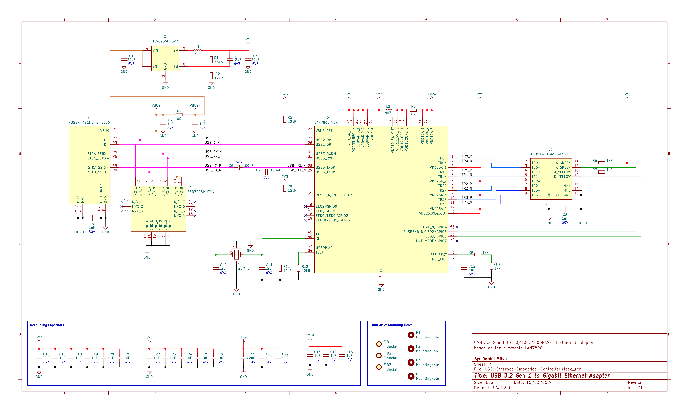

# USB-Ethernet-Embedded-Controller

## Overview

The **USB 3.2 Gen 1 to Gigabit Ethernet Adapter** is a hardware design developed to provide a wired Ethernet interface to a computer through a USB Type-A connection.

  

  <a href="PDFs/USB-Ethernet-Embedded-Controller.pdf">
    View the complete schematic PDF
  </a>

The objective of the project is to design a standalone USB-to-Ethernet dongle that connects directly to a computer through a **USB Type-A plug** and converts the USB interface into a standard **10/100/1000BASE-T Ethernet interface**. The USB connection is implemented using a short integrated cable/pigtail, with the Type-A plug connected to the PCB, allowing an external Ethernet cable to be connected to the adapter and providing network connectivity to the host computer exclusively through the designed hardware.

The design is based on the **Microchip LAN7800**, a SuperSpeed USB 3.1 Gen 1 to 10/100/1000 Ethernet controller integrating the USB device controller and PHY, Ethernet MAC, and Gigabit Ethernet PHY.

The hardware additionally incorporates dedicated power regulation and high-speed ESD protection to support the USB and Gigabit Ethernet interfaces.

## Main Components

- **Microchip LAN7800-Y9X** — USB 3.1 Gen 1 to 10/100/1000 Ethernet controller
- **Texas Instruments TLV62568DBVR** — synchronous buck converter for the 3.3 V supply
- **USB Type-A plug with integrated cable/pigtail** — host-side USB 3.2 Gen 1 connection
- **onsemi ESD7008MUTAG** — multi-channel ESD protection for the high-speed USB interface
- **HALO HFJ11-E1G41E-L12RL** — integrated Gigabit Ethernet magnetics and RJ45 interface
- **25 MHz crystal** — LAN7800 reference clock

### USB and Ethernet Interfaces

The design integrates the USB and Ethernet interfaces around the LAN7800, with dedicated high-speed routing, ESD protection, Ethernet magnetics, and the external RJ45 connection.

The USB host connection is implemented using a **USB Type-A plug connected to the PCB through a short cable/pigtail**, allowing the finished board to operate as a direct-connect USB Ethernet dongle.

  

  <em>LAN7800 USB and Gigabit Ethernet interface section.</em>

### Power Architecture

The board includes a dedicated power-conversion stage to generate the required 3.3 V supply from the USB VBUS input, together with local decoupling and filtering for the main devices.

  

  <em>Power regulation and filtering section.</em>

## Project Status

**Work in Progress**

- Schematic: **Revision 3**
- Last schematic revision: **16 March 2024**
- PCB layout: **Not yet started**
- Firmware: **Not applicable**
- Prototype: **Not yet completed**

The current repository documents the schematic-level design of the USB-to-Gigabit Ethernet adapter. The schematic architecture and component selection have been developed, while PCB layout, routing, manufacturing, and subsequent hardware validation remain to be completed.
